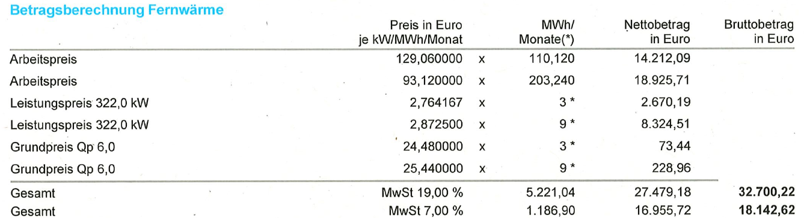
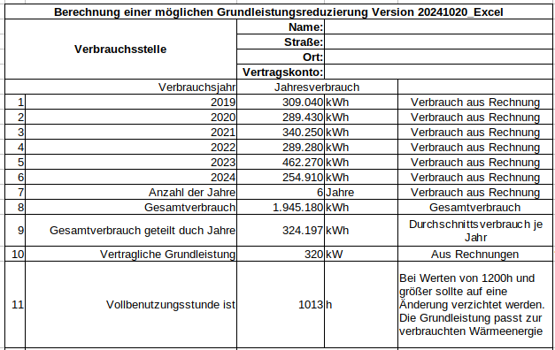

# Fernwärme von den Stadtwerken Karlsruhe

## Erläuterungen zur Abrechnung

Laut [Info-Flyer der Statdwerke Karlsruhe](https://www.stadtwerke-karlsruhe.de/wMedia/docs/service/infomaterial/preisblaetter/tarifflyer-fernwaerme.pdf) (Stand 04/25, Version FW 2.0) setzt sich der Preis für Fernwärem aus diesen vier Bestandteilen zusammen:

1. Der **Arbeitspreis** wird berechnet für die Energiemenge, die Sie
verbrauchen.

2. Der **Grundpreis** deckt den Aufwand für den Wärmezähler, die Ablesung
und die Abrechnung. Er ist je nach Zählergröße gestaffelt.

3. Der **Leistungspreis** ist ein Pauschalbetrag für die Größe Ihres
Anschlusses. Er wird in Euro pro Kilowatt und Jahr berechnet.

4. Der **Emissionspreis** ist für die durch die Erzeugung von Wärme
entstandenen CO2-Emissionen zu bezahlen. Die abgenommene Wärme
entspricht der Menge des Wärmeverbrauchs (wie beim Arbeitspreis).

In dem genannten Flyer sind folgende **Grundpreis**e tabellarisch aufgelistet:
> 
> | Grundpreis Euro/Monat | Netto | Brutto |
> | --------------------- | ----- | ------ |
> | q_p 0,6               | 8,11  | 9,65   |
> | q_p 1,5               | 16,22 | 19,30  |
> | q_p 2,5               | 22,33 | 26,57  |
> | q_p 3,5               | 24,38 | 29,01  |
> | q_p 6,0               | 26,38 | 31,39  |
> | q_p 10,0              | 28,44 | 33,84  |
> | q_p 15,0              | 32,49 | 38,66  |
> | q_p 25,0              | 35,86 | 42,67  |
> | q_p 40,0              | 38,60 | 45,93  |
> | q_p 60,0              | 47,28 | 56,26  |
> | q_p 150,0             | 50,77 | 60,42  |
> 
> Preisstand: 01.04.2025. Die Bruttopreise verstehen sich inkl.
> Umsatzsteuer in der jeweils gesetzlich festgelegten Höhe 
> (zurzeit 19 %). Sämtliche vorstehend ausgewiesenen 
> Nettopreise enthalten Konzessionsabgabe in Höhe von 
> jeweils 15 %.

Meine Abrechnung für das Jahr 2024 weist folgende Werte auf:

|                          | Preis in Euro je kW/MWh/Monat  | MWh/Monate(*) | Nettobetrag in Euro  |
|:------------------------ | ------------------------------:| -------------:| -------------------:|
| Arbeitspreis             | 129,060000                     | 110,120       | 14212,09            |
| Arbeitspreis             |  93,120000                     | 203,240       | 18925,71            |
| Leistungspreis 322,00 kW |   2,764167                     | 3 (*)         |  2670,19            |
| Leistungspreis 322,00 kW |   2,872500                     | 9 (*)         |  8324,51            |
| Grundpreis Qp 6,0        |  24,480000                     | 3 (*)         |    73,44            |
| Grundpreis Qp 6,0        |  25,440000                     | 9 (*)         |   228,96            |

Die Mehrwersteuer auf Fernwärme beträgt grundsätzlich 19%. Im Zuge der "Gaskrise" wurde von Ende Oktober 2022 bis einschließlich März 2024 
für Gas und Fernwärme der ermäßigte Mehrwertsteuersatz von 7% abkassiert. Ab dem 01.04.2024 galt wieder der ursprüngliche Satz von 19%:

    (14212,09€ + 2670,19€ +  73,44€) * 1,07 = 16955,72€ * 1,07 = 16955,72€ + 1186,90€ = 18142.62€

    (18925,71€ + 8324,51€ + 228,96€) * 1,19 = 27479,18€ * 1,19 = 27479,18€ + 5221.04€ = 32700.22€

Das stimmt mit der Abrechnung der Stadtwerke überein.

Die **Arbeitspreise** sind in **€/MWh**: 

        129,060000 €/MWh * 110,120 MWh = 14212,0872 €

         93,120000 €/MWh * 203,240 MWh = 18925,7088 €

Die **Leistungspreise** sind in **€/kW/Monat**:

        2,764167 €/kW/Monat * 322,00 kW * 3 Monate = 2670.185322 €

        2,872500 €/kW/Monat * 322,00 kW * 9 Monate = 8324.505 €

Die **Grundpreise** sind in **€/Monat**:

        24,480000 €/Monat * 3 Monate =  73,44 €

        25,440000 €/Monat * 9 Monate = 228,96 €

Tatsächlich weist der alte Flyer ab dem 01.04.2024 einen Nettopreis für Qp 6,0 von 25,44 € auf. Für den Leistungspreis weist er einen Nettopreis von 34,47 €/kW/Jahr auf, was den 2,8725 €/kW/Monat entspricht.

Leider habe ich nur die beiden Preistabellen ab 01.04.2024 und ab 01.04.2025. Falls jemand ältere Preisetabellen hat, möge er sich bitte bei mir melden.

## Anschlusswerte reduzieren und Geld sparen

Der [Bund der Energieverbraucher](https://www.energieverbraucher.de/) erklärt, unter welchen Bedingungen und wie man seine [Anschlusswerte reduzieren](https://www.energieverbraucher.de/de/anschlusswerte-zu-hoch__507/) kann. 

> Leistungsbedarfs-Abschätzung über Benutzungsstunden
>
> Teilt man die in den vergangenen Jahren **im Schnitt verbrauchte Wärme (Einheit kWh)** durch die vertraglich vereinbarte **Grundleistung (Einheit kW)**, dann erhält man die Vollbenutzungsstunden (Einheit h = Stunden).
>
> Beispiel: In drei Jahren wurden durchschnittlich jedes Jahr 9.937 kWh verbraucht. Dividiert man dies durch die vereinbarte Grundleistung von 14,84 kW ergeben sich 760 Vollbenutzungsstunden. 
>
> Man rechnet für eine effiziente Anschlussnutzung mit 1.200 Benutzungsstunden. Das entspricht dem bundesweiten Mittelwert und berücksichtigt Nutzerverhalten, Gebäudesituation und Klimaeinflüsse. Um jetzt die tatsächlich ausreichende Grundleistung abzuschätzen, dividiert man die verbrauchte Wärme (Einheit kWh) durch 1.200 (Einheit Stunden) und erhält damit die benötigte Anschlussleistung. 
>
> Beispiel: 9.937 / 1200 = 8,28 kW. 
>
> Dann addiert man zur Sicherheit noch 10%. Daraus ergibt sich der neue Wert für die benötigte Grundleistung. Dieser Wert ist in der Regel höher, als hätte man den bisherigen Anschlusswert halbiert. 
>
> Beispiel: 8,28 + 10% = 9,11 kW. Die Reduzierung um 50% hätte zu 7,42 kW Leistung geführt. Die Reduzierung um 5,73 kW führt im Beispiel zu einer jährlichen Ersparnis des Grundpreises von 221 Euro.
>

Mein **durchschnittlicher Wärmeverbrauch** in den letzten sechs Jahren lag bei 324,20 MWh = **324200 kWh**. Das Maximum bei 462270 kWh, das Minimum bei 254910 kWh.

Die vertraglich vereinbarte Grundleistung entnehmen wir dem **Leistungspreis 320,00 kW** zu 322,00 kW. Der Preis für diese Anschlussleistung liegt (ab 01.04.2025) bei **35,75 €/kW/Jahr** netto (42,54 €/kW/Jahr brutto, inkl 19% MwSt) bzw. bei **2,97916666667 €/Kw/Monat** netto.

Mit dem Durchschnittsverbrauch berechnen wir die **Vollbenutzungsstunden** zu 

    324200 kWh / 322,00 kW = 1013,125 h

Dieser Wert liegt nicht allzuweit unterhalb des Bereiches der optimalen Auslastung von 1200 bis 1500 Vollbenutzungsstunden. Teilen wir 
unsrere 324200 kWh durch 1200 h kommen wir auf eine GRundleistung von 270,16 kW.

    324200 kWh / 1200 h = 270,16 kW

Mit den 10% Sicherheitszuschlag ergeben sich 297,18 kW Anschlussleistung

    (324200 kWh / 1200 h) * 1,10 = 297,18 kW

Mit einer vertraglich vereinbarten Leistung vom 300 kW ergäbe sich ein Jahrespreis von 12735 €/Jahr:

    300 kW * 42,54 €/kW/Jahr = 12735 €/Jahr (brutto, inkl. MwSt)

Bleiben wir bei den 320 kW, kommen wir auf 13612,80 €/Jahr:

    320 kW * 42,54 €/kW/Jahr = 13612,80 €/Jahr (brutto, inkl. MwSt)

**Die jährliche Ersparnis bei einer Reduktion der vertraglich vereinbarten Leistung auf 300 kW läge also bei 877,8 €.**

Mir persönlich erscheinen sowohl der höchste (462270 kWh) als auch der niedrigste Jahresverbrauch (254910 kWh) zu extrem. 
Streicht man beide Werte, ergibt sich ein jährlicher Durchschnittsverbrauch von 307000 kWh. Damit wäre nach obiger Rechnung 
eine Reduktion der Anschlussleistung auf 255,83 kW möglich, um auf die 1200 Vollbenutzungsstunden im Jahr zu kommen:

    (307000 kWh / 1200 h) * 1,10 = 255,83 kW

Man könnte also - um auf der sicheren Seite zu bleiben - die Anschlussleistung auf die weiter oben berechneten 270 kW reduzieren. Damit ergäbe sich dann eine jährliche Ersparnis von 2151,30 €:

    270 kW * 42,54 €/kW/Jahr = 11461,50 €/Jahr (brutto, inkl. MwSt)

    13612,80 €/Jahr - 11461,50 €/Jahr = 2151,30 €/Jahr

**Dazu sollte man aber unbedingt die Meinung eines echten Experten einholen. Ich weiß nicht, welche negativen Auswirkungen eine zu klein gewählte Anschlussleistung haben kann.**